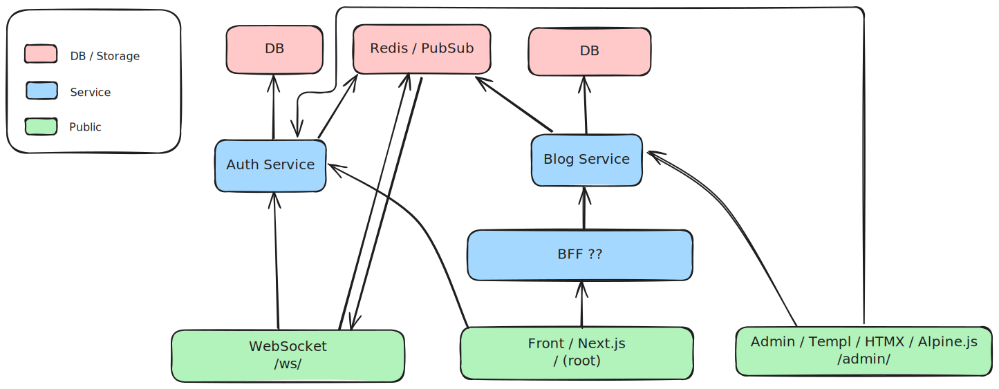

# Live Blog - WIP

Protobuf, gRPC and service architecture playground.

```bash
migrate create -ext sql -dir database/migrations create_posts_table


go run . migrate up


sqlc generate
```


## Project Diagram - WIP


