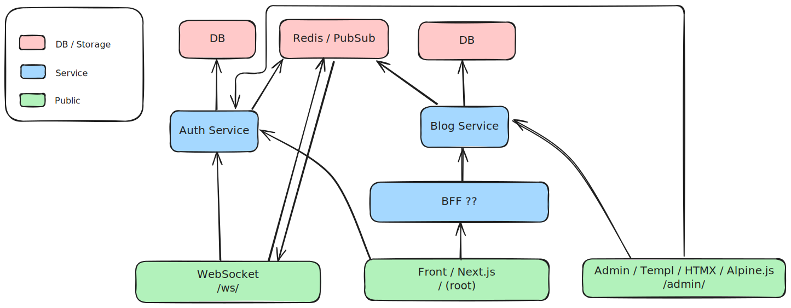

# Live Blog - WIP

Protobuf, gRPC and service architecture playground.

```bash
migrate create -ext sql -dir database/migrations create_posts_table


go run . migrate up


sqlc generate
```

```bash
air -c .air-blog-service.toml
# OR
air --build.cmd "go build -o ./blog-service/tmp/main ./blog-service" --build.entrypoint "./blog-service/tmp/main"
```

```bash
air -c .air-admin.toml
# OR
air --build.cmd "go build -o ./admin/tmp/main ./admin" --build.entrypoint "./admin/tmp/main"
```


## Project Diagram - WIP


